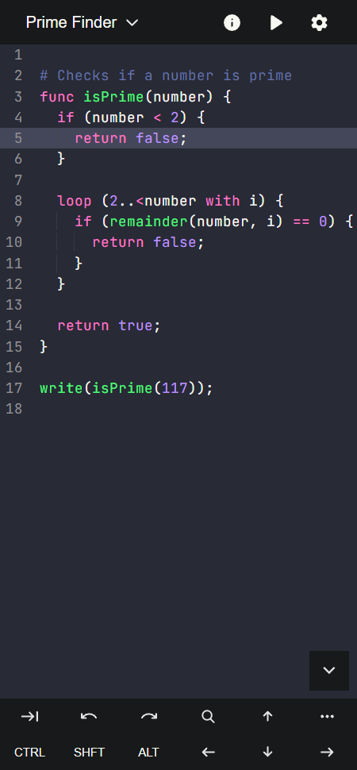
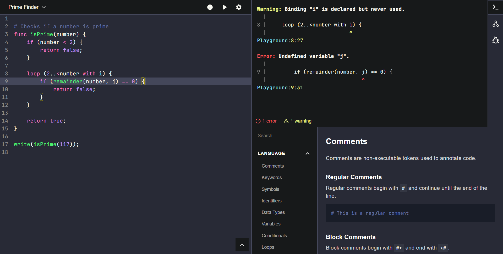
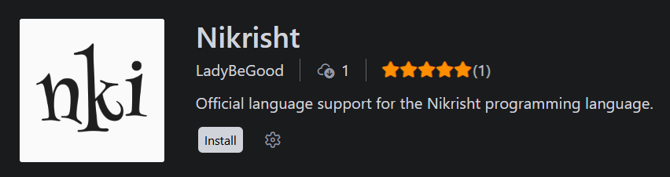

<div align="center">

# Nikrisht

[](https://ladybegood.github.io/nikrisht)


*profound tagline goes here*

</div>

## Introduction
Nikrisht is a small, dynamically typed scripting language with an AST-walking interpreter, built from scratch in JavaScript with JSDoc-based type checking, and runs in both Node and the browser without a build step.

## Examples

**Prime, naive**
```nim
# Checks if a number is prime
func isPrime(number) {
    if (number < 2) {
        return false;
    }

    loop (2..<number with i) {
        if (remainder(number, i) == 0) {
            return false;
        }
    }

    return true;
}

write(isPrime(117));
```

**Merge sort**
```nim
# Sorts an array using Merge Sort algorithm
func mergeSort(array) {
    # Base case, an array of 0 or 1 elements is already sorted
    if (count(array) <= 1) {
        return array;
    }

    # Split the array into two halves
    const middle = floor(count(array) / 2);

    # Sort both halves, recursively
    const left = mergeSort(slice(array, 1, middle));
    const right = mergeSort(slice(array, middle + 1, count(array)));

    # Merge the two sorted halves
    const result = [];
    var i = 1;
    var j = 1;

    loop (i <= count(left) & j <= count(right)) {
        if (left[i] <= right[j]) {
            put(result, left[i]);
            i = i + 1;
        } else {
            put(result, right[j]);
            j = j + 1;
        }
    }

    # Add any remaining elements from the left half.
    loop (i <= count(left)) {
        put(result, left[i]);
        i = i + 1;
    }

    # Add any remaining elements from the right half.
    loop (j <= count(right)) {
        put(result, right[j]);
        j = j + 1;
    }

    return result;
}

write(mergeSort([10, -1, 2, 5, 0, 9]));
```

**Fibonacci, memoized**
```nim
const cache = {};

func fibonacci(number) {
    if (has(cache, number)) {
        return cache[number];
    }

    if (number <= 1) {
        return number;
    }

    cache[number] = fibonacci(number - 1) + fibonacci(number - 2);
    return cache[number];
}

write(fibonacci(8));
```


## Getting Started

### Playground
You can try Nikrisht instantly in your browser without any installation or setup.

 



### Installation
[](https://www.npmjs.com/package/nikrisht)
[](https://www.npmjs.com/package/nikrisht)
[](https://www.npmjs.com/package/nikrisht)
[](https://www.npmjs.com/package/nikrisht)

```bash
npm install -g nikrisht
```

To run a nikrisht file `input.nki`:

```bash
nki input.nki
```

### Editor setup



For the best development experience, install the official **Nikrisht VS Code Extension** to get full syntax highlighting, error checking, and code snippets:

1. Open VS Code.
2. Open the Extensions view (`Ctrl+Shift+X` or `Cmd+Shift+X`).
3. Search for **Nikrisht** by **LadyBeGood**
4. Click Install.


## Acknowledgements

### Foundations
- [Microsoft's TypeScript Compiler](https://github.com/microsoft/TypeScript/) - A very well-written codebase to study for transpiler design. 
    - [Nathan Shively-Sanders' Mini- & Centi-TypeScript](https://github.com/sandersn/mini-typescript) - Miniature models of the TypeScript compiler.
    - [Orta Therox's TypeScript compiler guide](https://youtu.be/X8k_4tZ16qU?si=hYu4txp-OmW-iW5f) - A YouTube presentation exploring the inner workings of the TypeScript compiler.
    - [Simone Poggiali's The Concise TypeScript Book](https://github.com/gibbok/typescript-book) - An incredibly informative TypeScript guide.
- [Robert Nystrom's Crafting Interpreters](https://craftinginterpreters.com) - The definitive blueprint for anyone building a language from scratch. 
    - [Rockcavera's Nlox](https://github.com/rockcavera/nim-nlox/) - A Nim implementation of the Lox programming language.
    - [James Hutcheon's Glox](https://github.com/hutcho66/glox) - A Go implementation of a superset of Lox programming language with many ergonomic additions.
- [Tyler Laceby's Programming Language Guide](https://youtube.com/playlist?list=PL_2VhOvlMk4UHGqYCLWc6GO8FaPl8fQTh&si=ROqcOk6DfMtiqsNP) - An excellent YouTube playlist on building a custom scripting language in TypeScript.
- [Meriyah](https://github.com/meriyah/meriyah/) - A 100% compliant, self-hosted JavaScript parser.


### Resources
- [AST Explorer](https://astexplorer.net/) - A web tool to explore the ASTs generated by various parsers.
- [Syntax across languages](https://rigaux.org/language-study/syntax-across-languages.html) - A comparison of syntax across many programming languages. 
- [regex101](https://regex101.com/) - Regex editor for testing and learning regular expressions. Very helpful while creating syntax-highlighting patterns for the VSCode extension and website playground.
- [Matt Neuburg's guide on writing TextMate grammar](https://www.apeth.com/nonblog/stories/textmatebundle.html) - A comprehensive reference for understanding TextMate grammar internals and syntax highlighting behavior. You will have a very hard time dealing with TextMate if you don't digest this guide first.


## License

- [`/interpreter`](./interpreter), [`/documentation`](./documentation), [`/cli`](./cli), [`/tests`](./tests) - MIT-0, see each folder's `license.txt`
- [`/website`](./website), [`/extension`](./extension) - All Rights Reserved
